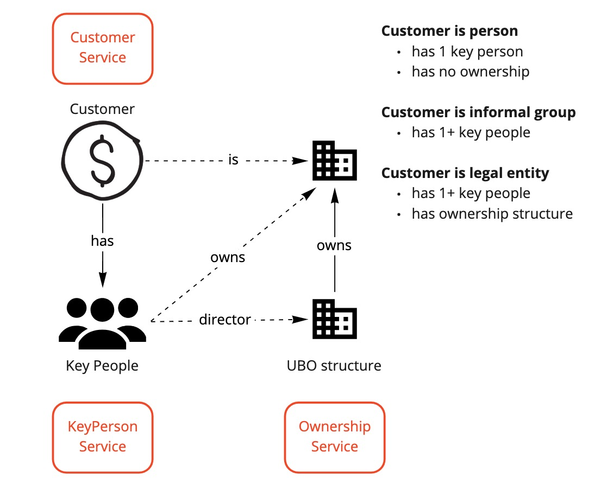

# README #

The `customer` microservice manages core customer data such as name and nature and purpose. 
In Avid, a customer is the entity that has the direct relationship with the tenant, i.e. is 
the customer of.

A customer can either be an individual or an customer of some kind. If an customer, the
customer may have key people ([key-person service](https://github.com/anqaml/key-person))
who are either agents or in control.

## Getting Started
If you are new to Avid development please read 
[this guide to getting started](https://app.gitbook.com/@anqaml/s/docs/getting-started/overview).